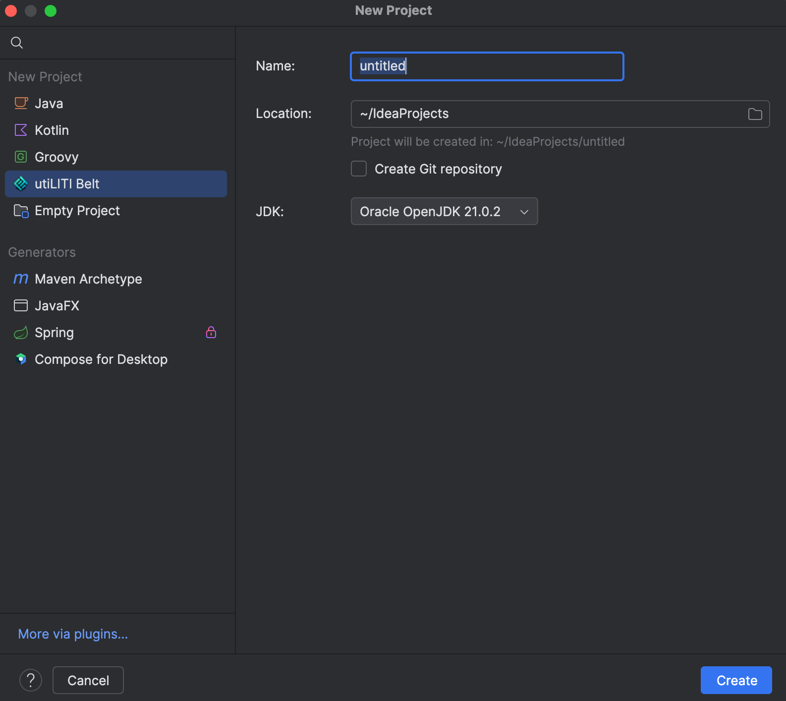
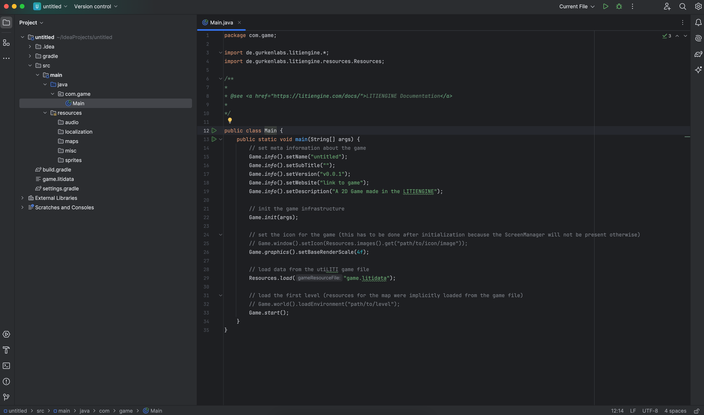

#  utiLITI Belt

utiLITI Belt is an IntelliJ Plugin that easily generates a new LITIENGINE Project.

---

## 🚀 Features

- Create a new LITIENGINE project with just a few clicks
- Automatically sets up folder structure, dependencies, and main class
- Includes basic resource folders
- Future plans: add more utilities to streamline game dev with LITIENGINE

---

## 📸 Screenshots

| Description                           | Screenshot                                                                               |
|---------------------------------------|------------------------------------------------------------------------------------------|
| Project Wizard UI                     |   |
| LITIENGINE Project                    |     |
| LITIENGINE Game Window                |           |

---

## 📦 Installation

[utiLITI Belt plugin page](https://plugins.jetbrains.com/plugin/27051-utiliti-belt)

1. Install a compatible JetBrains IDE, IntelliJ IDEA, or other IntelliJ-based IDEs 
2. Launch the IDE and open plugin settings 
3. Search for Utiliti Belt and click install 
4. Click New Project + 
5. Finally, click Utiliti Belt to create a new LITIENGINE project

---

## 📁 Project Structure

```bash
new-project/
├── src/
│   └── main/
│       ├── java/
│       │   └──com.game
│       │   │   └── Main.java
│       └── resources/
│           ├── audio/
│           ├── localization/
│           ├── maps/
│           ├── misc/
│           └── sprites/
└── game.litidata
```

---

## 🤝 Contributing

Contributions are welcome! Feel free to open issues or submit pull requests.

1. Fork the repo
2. Create a feature branch (`git checkout -b feature/thing`)
3. Commit your changes
4. Push and open a PR

---

## 📟 License

[MIT](LICENSE)

---

## 🙌 Acknowledgements

- [LITIENGINE](https://litiengine.com)
- [JetBrains Plugin SDK](https://plugins.jetbrains.com/docs/intellij/welcome.html)

---

## 📬 Contact

Have questions or feedback?\
Open an issue or reach out on [BlueSky](https://bsky.app/profile/iamllcoolray.bsky.social) / [email](mailto\:iamllcoolray@gmail.com)

